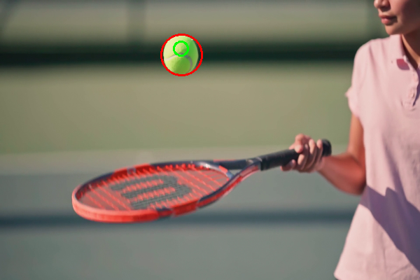

# 🎾 Tennis Ball Tracker

A real-time tennis ball detection and tracking system with both **command-line** and **modern GUI interfaces**. This project uses computer vision techniques including HSV color segmentation and Kalman filtering for robust ball tracking in video streams.



---

## ✨ Features

### **Dual Interface**
- **🖥️ Modern GUI Application** - Professional desktop interface with drag & drop video upload
- **⌨️ Command-Line Tool** - Lightweight CLI for batch processing and scripting

### **Advanced Tracking**
- **HSV Color Detection** - Robust tennis ball detection using color space segmentation
- **Kalman Filter Prediction** - Smooth trajectory prediction and occlusion handling
- **Real-Time Processing** - Optimized for live video analysis on standard hardware
- **Visual Contrast** - Orange markers for detected positions, green for predictions

### **User Experience**
- **Drag & Drop Upload** - Easy video file loading
- **Multiple Format Support** - Works with any OpenCV-compatible video format (MP4, AVI, MOV, MKV, WMV, etc.)
- **Playback Controls** - Play, pause, restart, and loop functionality
- **Live Coordinate Display** - Real-time position tracking overlay
- **Responsive Design** - Adaptive video sizing to fit your screen

---

## 🎨 GUI Preview

The modern GUI features a formal dark theme with:
- **Pure Black Background** (#000000) - Maximum contrast
- **Dark Blue Panels** (#14213d) - Professional modular design
- **Orange Accents** (#fca311) - High visibility highlights
- **Orange Detection Markers** - Clear indication of detected ball position
- **Green Prediction Markers** - Visual distinction for Kalman filter predictions

---

## 📋 Prerequisites

### **System Requirements**
- **Windows** (primary support), Linux, or macOS
- **Python 3.8+**
- **Webcam or Video Files** for testing

### **Python Packages**
- OpenCV (`opencv-python`)
- NumPy
- CustomTkinter (for GUI)
- Pillow (for GUI)
- tkinterdnd2 (for drag & drop)

---

## 🚀 Quick Start

### **Option 1: GUI Application (Recommended)**

1. **Clone or Download the Project**
   ```bash
   git clone https://github.com/TheBhardwajRohit/TennisBallTracker.git
   cd TennisBallTracker
   ```

2. **Create Virtual Environment (Optional but Recommended)**
   ```bash
   # Windows
   python -m venv venv
   venv\Scripts\activate

   # Linux/Mac
   python3 -m venv venv
   source venv/bin/activate
   ```

3. **Install GUI Dependencies**
   ```bash
   pip install -r requirements_gui.txt
   ```

4. **Launch the GUI**
   ```bash
   python run_gui.py
   ```
   
   Or simply double-click `run_gui.bat` (Windows)

### **Option 2: Command-Line Tool**

1. **Install Core Dependencies**
   ```bash
   pip install opencv-python numpy
   ```

2. **Run the Tracker**
   ```bash
   python track_ball.py --video path/to/your/video.mp4
   ```

3. **Exit**
   - Press `q` to quit the video window

---

## 📁 Project Structure

```
TennisBallTracker/
├── tennis_ball_tracker_gui_simple.py   # Main GUI application
├── track_ball.py                       # Command-line tracker
├── run_gui.py                          # GUI launcher with dependency checks
├── run_gui.bat                         # Windows batch launcher
├── requirements_gui.txt                # GUI dependencies
├── requirements.txt                    # All dependencies
├── requirements_windows.txt            # Windows-specific dependencies
├── README.md                           # This file
├── README_GUI.md                       # Detailed GUI documentation
├── tennis.mp4                          # Sample video
└── venv/                               # Virtual environment (created by user)
```

---

## 🎮 Usage Guide

### **GUI Application**

1. **Launch** the application using `run_gui.py` or `run_gui.bat`
2. **Upload Video** by:
   - Dragging and dropping a video file onto the upload area, OR
   - Clicking the "🔍 BROWSE FILES" button
3. **Wait** for the 3-4 second processing animation
4. **Watch** the video play automatically with tracking overlays:
   - **Orange circles** = Detected ball position
   - **Green circles** = Predicted position (Kalman filter)
5. **Control Playback**:
   - `⏸️ PAUSE` / `▶️ PLAY` - Toggle playback
   - `🔄 RESTART` - Reset video to beginning
   - `📁 NEW VIDEO` - Load a different video file

### **Command-Line Tool**

```bash
python track_ball.py --video <path-to-video>
```

**Example:**
```bash
python track_ball.py --video tennis.mp4
```

**Controls:**
- Press `q` to quit

---

## ⚙️ Configuration

### **Adjusting Detection Sensitivity**

If the tracker isn't detecting the ball properly, you can adjust the HSV color range in either `track_ball.py` or `tennis_ball_tracker_gui_simple.py`:

```python
# HSV range for tennis ball detection
# Adjust these values based on your video's lighting conditions
self.greenLower = (29, 86, 6)    # Lower HSV bound
self.greenUpper = (64, 255, 255)  # Upper HSV bound
```

**Tips:**
- **Lower H value** (e.g., 25) to detect yellower balls
- **Raise H value** (e.g., 35) to detect greener balls
- **Adjust S and V** for different lighting conditions

### **Kalman Filter Parameters**

The Kalman filter can be tuned in the `KalmanFilter` class:

```python
# Process noise covariance (higher = more responsive, less smooth)
self.kf.processNoiseCov = np.array([[1, 0, 0, 0], 
                                     [0, 1, 0, 0], 
                                     [0, 0, 1, 0], 
                                     [0, 0, 0, 1]], np.float32) * 0.03
```

---

## 🔧 How It Works

### **Detection Pipeline**

1. **Frame Preprocessing**
   - Gaussian blur to reduce noise
   - Resize for optimal processing speed

2. **Color Space Conversion**
   - Convert BGR to HSV color space
   - HSV is more robust for color-based detection

3. **Color Segmentation**
   - Create binary mask using HSV thresholds
   - Isolate tennis ball color range

4. **Morphological Operations**
   - Erosion to remove small noise
   - Dilation to fill gaps in the ball

5. **Contour Detection**
   - Find contours in the binary mask
   - Select largest contour as the ball

6. **Kalman Filter Tracking**
   - **Predict** next position based on motion model
   - **Update** prediction with detected position
   - Smooth trajectory and handle occlusions

7. **Visualization**
   - Draw detection circle (orange)
   - Draw prediction circle (green)
   - Display coordinates and status

---

## 🐛 Troubleshooting

### **GUI won't start**
```bash
# Reinstall GUI dependencies
pip install --upgrade -r requirements_gui.txt
```

### **No ball detected**
- Adjust HSV color range values
- Ensure good lighting in video
- Check if ball is clearly visible

### **Tracking is jumpy**
- Increase Kalman filter process noise
- Improve video quality/frame rate

### **ImportError for customtkinter**
```bash
pip install customtkinter
```

### **Video format not supported**
- Install full OpenCV: `pip install opencv-contrib-python`
- Convert video to MP4 format

---

## 🎓 Educational Use

This project was developed as a **Digital Image Processing (DIP)** college project demonstrating:
- Computer vision fundamentals
- Color space transformations
- Object detection and tracking algorithms
- Kalman filtering for state estimation
- GUI development with Python
- Real-time video processing

---

## 📝 Requirements Files

- **`requirements_gui.txt`** - Minimal dependencies for GUI only
- **`requirements.txt`** - All project dependencies
- **`requirements_windows.txt`** - Windows-specific packages

---

## 🤝 Contributing

Contributions are welcome! Feel free to:
- Report bugs
- Suggest new features
- Submit pull requests
- Improve documentation

---

## 📄 License

This project is licensed under the MIT License. See the `LICENSE` file for details.

---

## 👨‍💻 Author

**Rohit Bhardwaj**
- GitHub: [@TheBhardwajRohit](https://github.com/TheBhardwajRohit)

---

## 🙏 Acknowledgments

- OpenCV community for excellent computer vision tools
- CustomTkinter for modern GUI framework
- Kalman filter implementation inspired by classical tracking algorithms

---

**Last Updated:** November 6, 2025
